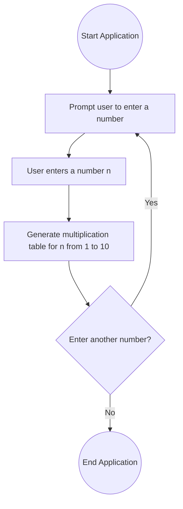

# Loops

```mermaid
flowchart TD
    A((Start Application)) --> B[Prompt user to enter a number]
    B --> C[User enters a number n]
    C --> D[Generate multiplication table for n from 1 to 10]
    D --> E{Enter another number?}
    E -- Yes --> B
    E -- No --> F((End Application))
```
