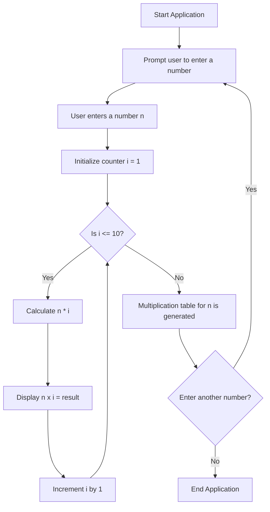

# Loops

```mermaid
flowchart TD
    A[Start Application] --> B[Prompt user to enter a number]
    B --> C[User enters a number n]
    C --> D[Initialize counter i = 1]

    D --> E{Is i <= 10?}
    E -- Yes --> F[Calculate n * i]
    F --> G[Display n x i = result]
    G --> H[Increment i by 1]
    H --> E

    E -- No --> I[Multiplication table for n is generated]
    I --> J{Enter another number?}
    J -- Yes --> B
    J -- No --> K[End Application]

```
